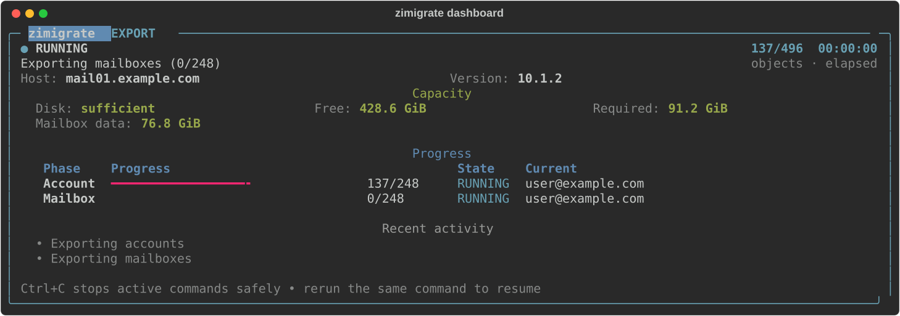
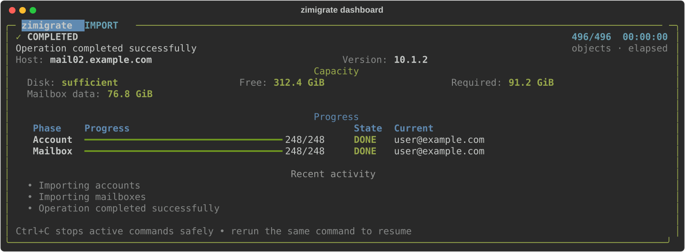

# zimigrate

[Türkçe dokümantasyon](README.tr.md)

`zimigrate` creates a resumable export of Zimbra provisioning data and mailbox
content, then imports that archive on a destination Zimbra server. Export and import
probe `zmprov`, `zmmailbox`, and `zmcontrol` instead of requiring a single Zimbra
release. Export never starts an import.

Two export placements are supported:

- **Local:** run on the Zimbra host; the archive is written in the current directory.
- **Remote:** run on a workstation with `./export.sh --target-ip HOST`; export runs on
  that Zimbra host over SSH, and the archive stays on the workstation.

## Contents

- [Install and run](#install-and-run)
- [Commands](#commands)
- [Usage alternatives](#usage-alternatives)
- [Interactive menus](#interactive-menus)
- [What is exported](#what-is-exported)
- [Import validation](#import-validation)
- [Requirements](#requirements)
- [Optional configuration](#optional-configuration)
- [Reliability and security](#reliability-and-security)
- [Known boundaries](#known-boundaries)
- [Development](#development)

## Install and run

Copy the whole repository, including `vendor/`. Change to a volume with enough free
space: `export_data` is created in the **current working directory**, not next to the
scripts.

`export.sh` and `import.sh` are the supported operator path. They use the vendored
x86_64 glibc CPython 3.12 runtime, pip wheels, and CA bundle first. They install OS
Python packages or download from GitHub only when `vendor/` is missing.

```bash
/path/to/zimigratex/export.sh
/path/to/zimigratex/import.sh
```

If Python 3.11+, a virtualenv, and a current install of this repository are already
present, the scripts skip OS package installation. Source changes invalidate the
runtime stamp and reinstall the package so an old `.venv` cannot run stale code.
Extra arguments are passed through.

Refresh vendored files on a machine with internet access:

```bash
./scripts/vendor-runtime.sh
```

If `vendor/` is absent and OS Python 3.11+ cannot be installed, the wrappers download
the same pinned CPython 3.12 runtime, verify its SHA-256 digest, and continue. Missing
optional packages such as `python3-venv` do not block `ca-certificates`. If the host
TLS store cannot verify GitHub, the download retries after installing CA certificates
and, as a last resort, without TLS verification; the pinned digest still rejects a
substituted archive. If a virtualenv still cannot be created, they run `zimigrate`
from `src/` after installing `rich` under `.runtime/`.

Manual install remains available:

```bash
cd /path/to/zimigratex
python3 -m venv .venv
. .venv/bin/activate
python -m pip install .
```

After that, `zimigrate` is on `PATH` for `status`, `verify`, `verify-target`, and
`preflight`. Wrappers are still preferred for export and import.

No configuration file is required for the default workflow. Source and destination
commands always execute against the **local** Zimbra installation. Multi-mailbox
source content may still be fetched from an account's `zimbraMailHost` over Zimbra's
admin REST port; that is not SSH command execution.

TOML `[source]` / `[target]` SSH settings are rejected. Remote export is only
`export --target-ip`.

## Commands

`--version`, `--verbose`, and `--json-logs` belong to the top-level `zimigrate`
command and must appear **before** the subcommand:

```bash
zimigrate --verbose export --archive ./export_data
zimigrate --json-logs import --archive ./export_data
```

`./export.sh` and `./import.sh` insert `export` / `import` before their extra
arguments, so pass archive, scope, and SSH flags to the wrappers, not `--verbose`.
For line-oriented logs with the wrappers, use `ZIMIGRATE_PLAIN_OUTPUT=1` or
`TERM=dumb`.

| Command | Purpose |
| --- | --- |
| `./export.sh [options]` | Export (local Zimbra, or SSH with `--target-ip`) |
| `./import.sh [options]` | Validate an archive and import into the local Zimbra |
| `zimigrate export` | Same as `export.sh` after install |
| `zimigrate import` | Same as `import.sh` after install |
| `zimigrate status` | Checkpoint counts and failed units |
| `zimigrate verify [--deep]` | Validate archive files without importing |
| `zimigrate verify-target` | Compare the destination with the archive |
| `zimigrate preflight` | Check local Zimbra commands and version |

Shared options on `export`, `import`, `verify`, and `verify-target`:

| Option | Meaning |
| --- | --- |
| `--archive DIR` | Archive directory (default: `./export_data`) |
| `--config FILE` | Optional TOML; secure defaults if omitted |
| `--user EMAIL` | Limit to this account and its domain (repeatable) |
| `--domain NAME` | Limit to this domain and its accounts (repeatable) |

`--user` and `--domain` accept comma-separated values and may be repeated:

```bash
./export.sh --user a@example.com --user b@example.com
./export.sh --domain example.com,other.com
```

Export-only:

| Option | Meaning |
| --- | --- |
| `--target-ip HOST` | SSH to this Zimbra host, run export there, keep the archive here |
| `--ssh-user NAME` | SSH username (default: `root`) |

`verify` also accepts `--deep` (scan every mailbox ZIP/TGZ). Import always does that
scan automatically.

`preflight` accepts `--config FILE` and `--side source|target|both` (default: `source`).

`status` accepts `--archive DIR` only.

Help for each path:

```bash
./export.sh --help
./import.sh --help
zimigrate --help
```

## Usage alternatives

### 1. Full local export on the Zimbra host

Install or copy the repository onto the source Zimbra server, `cd` to a large volume,
and run:

```bash
/path/to/zimigratex/export.sh
```

On a TTY this shows the category menu. Enter accepts every default (all categories).
The command writes:

```text
./export_data/
```

`Ctrl+C` stops in-flight Zimbra commands. Rerun the same command in the same directory
to resume.

### 2. Remote export from a workstation

From a machine that has `ssh` and `rsync` (not necessarily Zimbra):

```bash
./export.sh --target-ip 192.0.2.10
./export.sh --target-ip mail.example.com --ssh-user root
```

Behavior:

1. Category menu (and `--user` / `--domain` if given) runs on **this** machine.
2. SSH tries key login as `--ssh-user` (default `root`). If that works, no password
   is requested.
3. If key login fails and stdin is a TTY, zimigrate asks for username (default
   `root`) and password. The password is never placed on the `ssh` command line.
4. This repository is copied to `/var/tmp/zimigratex/<archive-id>/` on the Zimbra host.
5. Export runs there. Each completed mailbox file is rsync'd here immediately, then
   deleted on Zimbra, so remote disk stays near in-flight worker output, not the full
   backup.
6. The workstation must have room for the **entire** archive. Zimbra is checked only
   for in-flight peak (workers plus the file waiting to be pulled). Report:
   `export_data/reports/export-disk-assessment.json`.

Resume the same directory with or without `--target-ip`. The archive is bound to the
original host; a different `--target-ip` is rejected. Mailbox files already on this
machine are not copied back to Zimbra.

Password SSH needs a TTY. Non-interactive remote export needs working SSH keys.
The remote host must run `zmprov` as `zimbra` or via `sudo -n -u zimbra`.

### 3. Resume an interrupted job

```bash
./export.sh
./export.sh --target-ip 192.0.2.10
./import.sh
```

Successful units are skipped. Incomplete units resume. Resume is bound to the original
source host, Zimbra version, scope, and export options. A successful checkpoint is
reused only while its record and every referenced mailbox artifact still match their
recorded checksum and size.

Changing `--user` / `--domain` mid-archive requires a **new** archive directory
(export) or a copied archive with a fresh `state.sqlite3` (import). Import policies
from the first import attempt are locked in the checkpoint and cannot change silently
on resume.

Do not copy `export_data` while zimigrate is running.

### 4. One account or one domain

A scoped run skips the category prompt. Dependencies are included automatically.

```bash
./export.sh --user user@example.com
./export.sh --domain example.com
./export.sh --archive ./backup_example --domain example.com
```

`--user` includes that account, its domain, its COS, and its mailbox (if mailboxes
are enabled). `--domain` also includes alias domains, accounts, and distribution
lists for that domain.

Import can apply the same filter to a **full** archive (export once, restore one
mailbox later):

```bash
./import.sh --user user@example.com
./import.sh --domain example.com
```

`--user` / `--domain` also skip the interactive “entire archive vs domains” prompt.

### 5. Custom archive directory

```bash
./export.sh --archive /srv/migration/export_data
./import.sh --archive /srv/migration/export_data
zimigrate status --archive /srv/migration/export_data
```

Use a separate directory per distinct scope, source host, or export-option set.

### 6. Move a local archive to the destination

After export has **stopped**, copy the whole directory. Preserve permissions and
`manifest.json`, `state.sqlite3`, `objects/`, `mailboxes/`, and `reports/`.

```bash
cp -a export_data /mnt/transfer/
```

On the destination, place that directory in the working directory (default name
`export_data`) or pass `--archive`.

### 7. Interactive import (archive picker)

On the destination, in a directory that contains one or more export archives, with a
TTY and **without** `--archive`:

```bash
./import.sh
```

zimigrate lists each child directory that has `manifest.json` and `state.sqlite3`
(skips `.git`, `.venv`, `src`, `vendor`, and similar). For each archive it shows
completeness, source host, last update, domain/account/list counts, whether mailbox
data is present, categories, and domain names. Choose a number, or Enter for the
default (`./export_data` if it exists, otherwise the first listing).

Then it asks:

1. Entire archive, or selected domain(s) (if the archive has domains).
2. The category menu (only categories that exist in that archive).

Only the chosen scope and categories are imported.

If stdin is not a TTY, or `--archive` is given, the picker is skipped
(default `./export_data` unless `--archive` is set).

```bash
./import.sh --archive ./backup_example
```

### 8. Non-interactive / scripted runs

A non-TTY uses config/CLI defaults: no category menu, no archive picker, no domain
prompt. `--user` / `--domain` still apply.

```bash
./export.sh --archive /srv/export_data --domain example.com
./import.sh --archive /srv/export_data --domain example.com
zimigrate --verbose export --archive /srv/export_data --domain example.com
zimigrate --json-logs import --archive /srv/export_data --domain example.com
```

`status` and `preflight` always print JSON. Export/import/verify print JSON only when
the live panel is off (see [Logging and the status panel](#13-logging-and-the-status-panel)).

### 9. Status, verify, and preflight

All of these default to `./export_data` except `preflight` (no archive):

```bash
zimigrate status
zimigrate verify --deep
zimigrate verify-target
zimigrate preflight --side source
zimigrate preflight --side target
zimigrate preflight --side both
```

- `status` — operation counts and failed entities from `state.sqlite3`.
- `verify --deep` — the same archive-level validation import always runs first.
- `verify-target` — destination objects vs the archive; reads locked import
  categories and mapping policy from the checkpoint. Import also runs this at the end.
- `preflight` — installed `zmprov` / `zmmailbox` / `zmcontrol` and optional target
  version pattern.

### 10. Disk checks

**Export:** `zmprov gqu` usage, archive growth, per-worker temporary space, and a
safety reserve. Insufficient space aborts before data is written.
`export_data/reports/export-disk-assessment.json`.

With `--target-ip`, that check on Zimbra covers in-flight files only. Size the
workstation for the full archive.

**Import:** `zmvolume -l` message/index volumes and temporary space, using each
archive member's **expanded** size. Insufficient space aborts.
`export_data/reports/import-disk-assessment.json`.

A local process cannot measure a mapped remote mailbox host, so that mapping aborts
by default. After checking every remote message and index volume, set
`allow_unverified_remote_capacity = true` in the import config.

### 11. After a successful import

Incomplete accounts stay in `maintenance` until every metadata and mailbox stage
succeeds, then the source status is restored. Account creates and password hashes use
`zmprov -l` (LDAP-direct) so Zimbra does not re-hash `{SSHA}`. zimigrate then runs
SOAP `zmprov fc account` so mailboxd drops a cached empty password or `maintenance`
status before `ldap_cache_account_maxage` (default 15 minutes). If the cache flush
fails, import stops and the account is put back in `maintenance`.

Repeat target verification later:

```bash
zimigrate verify-target --archive ./export_data
```

### 12. Optional TOML for policy changes

Copy [config.example.toml](config.example.toml) only when defaults must change:

```bash
cp config.example.toml migration.toml
./export.sh --config migration.toml
./import.sh --config migration.toml --archive ./export_data
```

If a config changes **import** behavior, copy that file to the destination and pass it
again on the first import. See [Optional configuration](#optional-configuration).

### 13. Logging and the status panel

Export, import, verify, and verify-target draw a live panel on an interactive
terminal (host, inventory, disk, per-phase progress). Classic line logs are used when
any of these apply:

- `--verbose`
- `--json-logs`
- non-TTY
- `TERM=dumb`
- `ZIMIGRATE_PLAIN_OUTPUT=1`

Example panels (from the built-in Rich renderer):





Regenerate after changing the dashboard layout:

```bash
PYTHONPATH=src python scripts/generate-readme-screenshots.py
```

## Interactive menus

Shown only when stdin is a TTY and the run is not already scoped by `--user` /
`--domain` (or a locked resume).

### Category menu (export and import)

```text
Select data categories to export:
  1. Domains and alias domains [default]
  2. Classes of service (COS) [default]
  3. Accounts, passwords, resources, identities, signatures, and preferences [default]
  4. Mailbox messages and item data [default]
  5. Static and dynamic distribution lists [default]
  6. Everything except mailbox data
```

- Enter or `all` — all available defaults.
- Comma-separated numbers — those categories.
- `6` — every available category except mailbox data.

Dependencies are added automatically:

| You pick | Also included |
| --- | --- |
| Accounts | Domains, COS |
| Mailboxes | Accounts, domains, COS |
| Distribution lists | Domains |

Import only offers categories that exist in the archive. Disabled rows cannot be
selected.

### Import scope

```text
Select import scope:
  1. Entire archive [default]
  2. Selected domain(s)
```

Option `2` lists domains from the archive; enter comma-separated numbers. Then the
category menu still applies to that domain set.

## What is exported

- domains, alias domains, and domain attributes;
- classes of service (COS), with source IDs remapped to destination IDs;
- accounts and calendar resources, including password hashes, aliases, preferences,
  forwarding/filter attributes, identities, signatures, and supported data sources;
- static and dynamic distribution lists, aliases, attributes, and static members;
- mail, calendars, contacts, tasks, and Briefcase content through Zimbra REST ZIP/TGZ;
- portable `zimbraACE` source UUIDs remapped to destination UUIDs.

Live authentication tokens are never exported. System account metadata is archived,
but system mailboxes and destination service identities are excluded by default.
Global and per-server LDAP configuration is not archived or applied (host names,
certificates, server IDs, ports, LDAP/MTA topology).

Zimbra stores four data-source credential fields encoded against the source
`zimbraDataSourceId`. Export decodes them in process, writes plaintext into the
archive, and lets the destination encrypt against its new data-source ID. During
restore each data source stays disabled until all attributes and credentials are
applied. Copying LDAP ciphertext would create unusable credentials.

## Import validation

`zimigrate import` does all of the following **before** any destination change:

- completed, supported `manifest.json`;
- original `state.sqlite3` present and readable;
- every domain, COS, account, resource, and list record readable;
- every provisioning record matches its checkpoint SHA-256;
- manifest object counts match files on disk;
- every mailbox file matches recorded size and SHA-256;
- no unreferenced object or mailbox files;
- every ZIP/TGZ is readable, intact, and uses safe member paths;
- every required `zmprov` / `zmmailbox` command exists on this host.

Any failure exits before changing the destination. After a fix or recopy, run import
again.

## Requirements

- Python 3.11 or newer and the Python `rich` package (or the wrapper/`vendor` path);
- a 64-bit x86_64 glibc Linux host supported by the installed Zimbra release;
- for **local** export/import: `/opt/zimbra/bin/zmprov`, `zmmailbox`, `zmcontrol`,
  `zmhostname`; run as `zimbra` or with `sudo -n -u zimbra`;
- for **remote** export: local `ssh` and `rsync`; the Zimbra host still needs the
  commands above;
- enough workstation/archive space, plus temporary space for one plaintext mailbox
  chunk per worker;
- a local Zimbra FOSS installation that passes preflight (on the machine that runs
  `zmprov`).

## Optional configuration

Defaults without a file: all normal accounts, mailbox content and visible secret
hashes, eight workers, merge existing objects, skip mailbox conflicts, strict
attributes, mailbox REST `meta=1` and `lock=1`.

```bash
cp config.example.toml migration.toml
```

Useful `[transfer]` keys:

| Key | Default | Notes |
| --- | --- | --- |
| `workers` | `8` | 1–64 |
| `retries` | `3` | Transient command failures only |
| `retry_base_seconds` | `1.0` | Exponential backoff base |
| `include_*` | `true` | Categories; CLI menu overrides on a TTY |
| `include_system_mailboxes` | `false` | Dangerous if enabled |
| `include_secrets` | `true` | Password hashes and data-source secrets |
| `account_include` / `account_exclude` | `["*"]` / `[]` | fnmatch patterns |
| `target_users` / `target_domains` | `[]` | Prefer CLI `--user` / `--domain` |
| `mailbox_mode` | `"full"` | Or `"year-chunks"` |
| `mailbox_format` | `"zip"` | Or `"tgz"` for older REST |
| `mailbox_lock` | `true` | If Zimbra rejects `lock=1`, export stops |
| `mailbox_start_year` | `1970` | Year-chunk start |
| `mailbox_chunk_years` | `5` | Year-chunk width |

Year chunks use numeric UTC epoch milliseconds (`date:<` / `date:>=`), not locale
dates. Ranges do not overlap. With `mailbox_conflict_resolution = "reset"`, only the
first chunk resets the mailbox; later chunks use `skip` so an earlier chunk is not
erased. `mailbox_mode = "full"` is the most complete snapshot. REST query export can
omit empty folders and items without a searchable date the same way Zimbra search
does.

Set `mailbox_lock = false` only in a controlled maintenance window.

Useful `[import]` keys:

| Key | Default | Notes |
| --- | --- | --- |
| `expected_target_version_pattern` | `""` | Empty = any preflight-passing release |
| `existing_policy` | `"merge"` | `merge`, `skip`, or `fail` |
| `mailbox_conflict_resolution` | `"skip"` | `skip`, `modify`, `replace`, or `reset` |
| `strict_attributes` | `true` | Schema rejection stops import |
| `import_system_accounts` | `false` | Leave off unless you intend it |
| `allow_unverified_remote_capacity` | `false` | See disk checks |
| `default_mailhost` | unset | Multi-mailbox destination |
| `[import.mailhost_map]` | empty | Old hostname → new hostname |

`strict_attributes = false` only after reviewing `reports/import-warnings.ndjson`.
Service, connection, and timeout errors are never downgraded to attribute warnings.

`[source]` / `[target]` may set `zimbra_user`, command/mailbox timeouts, and admin
REST scheme/port. `mode = "ssh"` and SSH-related keys are rejected.

Removed keys (`include_global_config`, `apply_global_config`, `server_map`, archive
encryption keys, and similar) cause a configuration error; they are not ignored.

`[source]` and `[target]` `command_timeout_seconds` default to 300;
`mailbox_timeout_seconds` defaults to 14400.

## Reliability and security

The archive uses SHA-256 checksums for provisioning records and mailbox payloads,
atomic writes, `0600` files, a `0700` directory, and a required SQLite checkpoint
database. Records and mailbox payloads are stored in plaintext. Worker submission is
bounded. Only classified transient failures use limited exponential retries.
Temporary mailbox chunks live under `export_data/.tmp` and are removed afterward.
Sensitive `zmprov` values use stdin batch input, not process arguments.

The mailbox protocol follows Zimbra's
[REST export/import reference](https://github.com/Zimbra/zm-mailbox/blob/develop/store/docs/rest.txt).
The
[official command-line guide](https://github.com/Zimbra/adminguide/blob/develop/cmdlineutils.adoc)
is the operational reference for `zmprov`, `zmmailbox`, and cache commands.

Keep the directory on trusted, preferably disk-encrypted storage. A copied archive
contains account names, password hashes when secret export is enabled, mailbox
content, and checkpoint metadata. See [SECURITY.md](SECURITY.md).

## Known boundaries

- This is an application-level migration, not a physical LDAP/MariaDB/blob restore.
- Certificates, private key files, `zmlocalconfig`, OS packages, MTA queues, DNS,
  firewall rules, and commercial Network Edition backup state are not installed.
  Account `jpegPhoto`, `userCertificate`, and `userSMIMECertificate` are LDAP binary
  values; `zmprov` cannot restore DER/JPEG through argv, so import skips them.
- Signature default IDs are remapped after destination signatures are created.
  `zimbraPrefMailSignatureContactId` is a contact UUID and is left unset on the target.
- Cross-mailbox share IDs and topology-specific IDs can change. Validate delegated
  folders and recreate grants when necessary.
- Target verification compares provisioning state and successful mailbox REST import
  checkpoints; it does not perform an item-by-item mailbox content comparison.
- A live source can change during export. Use a maintenance/freeze window for the
  final run; mailbox REST export is not a cluster-wide transactional snapshot.
- Import disk assessment uses expanded archive-member size, not only compressed
  ZIP/TGZ size. Mapped remote mailbox hosts are rejected unless the operator accepts
  that limitation after checking every host.
- Destination version pinning is optional. Any local Zimbra release that can run
  `zmprov` / `zmmailbox` / `zmcontrol` is accepted unless
  `import.expected_target_version_pattern` is set.

## Development

```bash
PYTHONPATH=src python -m unittest discover -s tests -v
ruff check src tests
ruff format --check src tests
bandit -q -r src
python -m compileall -q src tests
```

## Author

Cuma KURT

- GitHub: [https://github.com/cumakurt/zimigratex](https://github.com/cumakurt/zimigratex)
- LinkedIn: [https://www.linkedin.com/in/cuma-kurt-34414917/](https://www.linkedin.com/in/cuma-kurt-34414917/)

## License

Copyright (C) 2026 Cuma KURT.

This program is free software: you can redistribute it and/or modify it under
the terms of the GNU Affero General Public License as published by the Free
Software Foundation, version 3 only. See [LICENSE](LICENSE).
